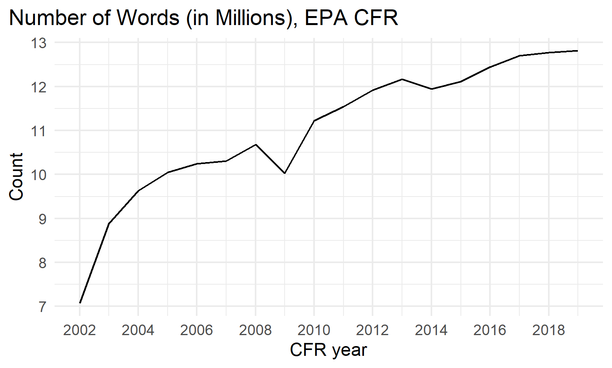
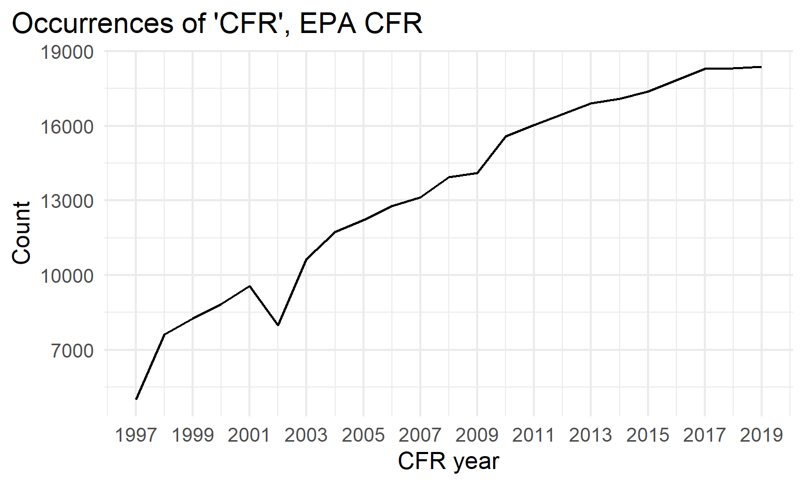

class: title-slide center

background-image: url(Parthum_Wheeler_Slides_files/EPA_seal.png), url(Parthum_Wheeler_Slides_files/NCEE_seal.png)
background-position: 35% 95%, 61% 93%
background-size: 10%, 20%

 
 
<h1>Understanding the Code of Federal Regulations through Natural Language Processing</h1>
<html>

</html>
 
 
<h2>Bryan Parthum and Will Wheeler   U.S. EPA, National Center for Environmental Economics   `r format(Sys.time(), '%B %d, %Y')`</h2>

---

class: remark-slide

<h1>Motivation</h1>

<h2>What is the goal?</h2>

  - The ability to quantify and classify the Code of Federal Regulations (CFR)
  
    - Think of this as capacity building. In order to ask interesting questions, we need to have the infrastructure in place to objectively read, process, and quantify federal documents.

--
count: false

<h2>What do we mean by quantify and classify?</h2>

--
count: false

  - There are many metrics, each are useful in their own way
    - Scoring within (\# words, rarity, etc.)
    - Scoring across (networks, dependencies, etc.)
  
  - Note: In the CFR, these measures have variation within parts, across parts, and across time

???

Upstream processing that will be used as inputs to other applications
Methods: classification using Bag of Words (BoW), Term Frequency Inverse Document Frequency (TF-IDF)

---

<h1>Text as Data <a href="https://journals.plos.org/plosone/article?id=10.1371/journal.pone.0195750" target="_blank" style="color:white">.font60[(Gentzkow et al. 2019)]</a></h1>

 

.pull-60[
<h2><bf>Quantify:</bf></h2>

.tab[]1\. Represent raw text $\mathcal{D}$ as a numerical array $\bf{C}$

<h2><bf>Classify:</bf></h2>

.tab[]2\. Map $\bf{C}$ to predicted class $\widehat{\hskip-0.5pt \bf{V}}$ of unknown class $\bf{V}$

<h2>Apply:</h2>

.tab[]3\. Use $\widehat{\hskip-0.5pt \bf{V}}$ in subsequent descriptive or causal analysis
]

???
1. Reduce the dimensionality of the text
2. Linking the text to categories of interest

---

<h1>NLP in Practice</h1>

<h2>Economics:</h2>
  - Effect of regulations on GDP (<a href="https://www.sciencedirect.com/science/article/abs/pii/S1094202520300223" target="_blank">Coffey et al. 2020</a>)
  - Tracking evolution of methods in economics (<a href="https://www.aeaweb.org/articles?id=10.1257/pandp.20201058" target="_blank">Currie et al. 2020</a>)
  - Understanding how people think about taxes (<a href="https://www.nber.org/papers/w27699" target="_blank">Stantcheva 2020; NBER</a>)
  - Valuing climate amenities using social media posts (<a href="https://journals.plos.org/plosone/article?id=10.1371/journal.pone.0195750" target="_blank">Baylis et al. 2018</a>, <a href="https://www.sciencedirect.com/science/article/abs/pii/S0047272720300256" target="_blank">Baylis 2020</a>)
  - Predicting future citations using referee comments (<a href="https://papers.ssrn.com/sol3/papers.cfm?abstract_id=2496624" target="_blank">Bandeh-Ahmadi, 2014</a>)
  - Contract flexibility as a result of environmental regulations (<a href="https://www.sciencedirect.com/science/article/abs/pii/S0144818813000811" target="_blank">Kosnik, 2014</a>)

<h2>Government:</h2>
  - ***"U.S. government agencies to use AI to cull and cut outdated regulations"*** (<a href="https://www.reuters.com/article/us-usa-regulations-white-house/u-s-government-agencies-to-use-ai-to-cull-and-cut-outdated-regulations-idUSKBN27130L" target="_blank">Reuters, 10/16/2020</a>)
  - Categorize public comments in rule-making (<a href="https://www.hhs.gov/cto/projects/increasing-efficiency-in-rule-making-with-natural-language-processing/index.html" target="_blank">HHS and EPA 2014</a>)
  - Task complexity in EPA's Standard Operating Procedures (<a href="https://journals.sagepub.com/doi/abs/10.1177/1071181319631108" target="_blank">Bird et al. 2009</a>)

---

<h1>Why NLP and the CFR?</h1>

.pull-left-c[  

]

.pull-right-c[  

]

---

<h1>Products</h1>

 
<h2>1. Code and documentation</h2>
  - Likely all in R, although there might be Python integration (all open source)
  - Public and freely available on GitHub
  

<h2>2. NCEE Working Paper</h2>
  - Summarize our approach to quantifying the CFR
  - An application to several outcomes of interest

---

<h1>Applications</h1>

<h2>Regulatory outcomes</h2>

  - NPDES, SDWA, RCRA, CERCLA (Superfund), etc.
  - Permitting: violations/non-compliance, proportion of applications approved, complaints
  - Litigation: length, contract completeness
  - EPA regulations that fall under other agencies (USGS, USDA, etc.)
  - Regulation across media (are water regs consistent with air, etc.)1

<h2>Environmental outcomes</h2>

  - Surface water and air quality (WQI/AQI)
  - Drinking water quality, test outcomes, etc.
  - Specific toxics as endpoints (how can we show the different ways that lead is regulated)1

.font60[[1] Examples of outcomes that are internal to the CFR]

---

<h1>Econometrics</h1>

<h3>What does a regression look like?</h3>

$$y_{{\small \bf{V}}t}=\bf{X}\beta + \Phi(\bf{C}_{{\small \widehat{\hskip-0.5pt \bf{V}}}t})\delta + \varepsilon_{{\small \bf{V}}t}$$
  - $\bf{C}$ is upstream NLP processing of $\mathcal{D}$ (quantify)
  - $\widehat{\hskip-0.5pt \bf{V}}$ is predicted class using ML (classify)
  
  - $\Phi(\bf{C}_{{\small \widehat{\hskip-0.5pt \bf{V}}}t})$ can consist of many metrics/features:
    - sum of word/phrase count (simple "token" score)
    - sum of TF-IDF scores in part/subpart
    - relational/network features of other parts $\in\mathcal{D}$
    - relational/network features of other documents $\notin\mathcal{D}$
  
---

<h1>Other Applications and Extensions</h1>

<h2>Other applications and extensions</h2>
  - Spatial distribution of Title 40 (map network/complexity to geographical units, demographics, industries)
  - Process ICRs 
  - Complexity of EPA Guidelines
  - Leadership influence on network/complexity (i.e. $\bf{C}_{{\small \widehat{\hskip-0.5pt \bf{V}}}t}$ becomes dependent variable)
  - Apply text methods to permits, consumer confidence reports, FOIA requests, and on and on

  - *[YOUR PROJECT HERE]*

---

class: title-slide center

background-image: url(Parthum_Wheeler_Slides_files/EPA_seal.png), url(Parthum_Wheeler_Slides_files/NCEE_seal.png)
background-position: 35% 95%, 61% 93%
background-size: 10%, 20%

.pull-60[
.font140[
<b>Thank you!</b>
<html>

</html>

Questions?
]
]
.pull-left[
.font120[Bryan Parthum]

]

.pull-right[
.font120[Will Wheeler]

]

---

class: remark-slide

<h1>Examples from the CFR</h1>

<b>40 CFR § 60.4201:</b> What emission standards must I meet for non-emergency engines if I am a stationary CI internal combustion engine manufacturer?

.font90[
.pull-60[
<b>(a)</b> Stationary CI internal combustion engine manufacturers must certify their 2007 model year and later non-emergency stationary CI ICE with a maximum engine power less than or equal to 2,237 kilowatt (KW) (3,000 horsepower (HP)) and a displacement of less than 10 liters per cylinder to the certification emission standards for new nonroad CI engines in .blue[40 CFR 89.112], .blue[40 CFR 89.113], .blue[40 CFR 1039.101], .blue[40 CFR 1039.102], .blue[40 CFR 1039.104], .blue[40 CFR 1039.105], .blue[40 CFR 1039.107], and .blue[40 CFR 1039.115], as applicable, for all pollutants, for the same model year and maximum engine power.
]
]

- subpart (a) of 8 (with 7 more sub-subparts)
- 9 internal references
- spiderweb of references from referenced parts

---
count: false

<h1>Examples from the CFR</h1>

<b>40 CFR § 60.4201:</b> What emission standards must I meet for non-emergency engines if I am a stationary CI internal combustion engine manufacturer?

.font90[
.pull-60[
<b>(a)</b> Stationary CI internal combustion engine manufacturers must certify .l-blue[their] 2007 model year .l-blue[and] later non-emergency stationary CI ICE with .l-blue[a] maximum engine power less than .l-blue[or] equal .l-blue[to] 2,237 kilowatt (KW) (3,000 horsepower (HP)) .l-blue[and a] displacement .l-blue[of] less than 10 liters .l-blue[per] cylinder .l-blue[to the] certification emission standards .l-blue[for] new nonroad CI engines .l-blue[in] .blue[40 CFR 89.112], .blue[40 CFR 89.113], .blue[40 CFR 1039.101], .blue[40 CFR 1039.102], .blue[40 CFR 1039.104], .blue[40 CFR 1039.105], .blue[40 CFR 1039.107], .l-blue[and] .blue[40 CFR 1039.115], .l-blue[as] applicable, for all pollutants, .l-blue[for the] same model year .l-blue[and] maximum engine power.
]
]

- Remove filler words (.l-blue[LIGHT BLUE])

---
count: false

<h1>Examples from the CFR</h1>

<b>40 CFR § 60.4201:</b> What emission standards must I meet for non-emergency engines if I am a stationary CI internal combustion engine manufacturer?

.font90[
.pull-60[
<b>(a)</b> Stationary CI internal combustion engine manufacturers .epa-green[must] certify .l-blue[their] 2007 model year .l-blue[and] later non-emergency stationary CI ICE with .l-blue[a] .epa-green[maximum] engine power .epa-green[less than] .l-blue[or] equal .l-blue[to] 2,237 kilowatt (KW) (3,000 horsepower (HP)) .l-blue[and a] displacement .l-blue[of] .epa-green[less than] 10 liters .l-blue[per] cylinder .l-blue[to the] certification emission standards .l-blue[for] new nonroad CI engines .l-blue[in] .blue[40 CFR 89.112], .blue[40 CFR 89.113], .blue[40 CFR 1039.101], .blue[40 CFR 1039.102], .blue[40 CFR 1039.104], .blue[40 CFR 1039.105], .blue[40 CFR 1039.107], .l-blue[and] .blue[40 CFR 1039.115], .l-blue[as] applicable, .epa-green[for all] pollutants, .l-blue[for the] same model year .l-blue[and] .epa-green[maximum] engine power.
]
]

- Remove filler words (.l-blue[LIGHT BLUE])
- Weight action words (.epa-green[GREEN])

---
count: false

<h1>Examples from the CFR</h1>

<b>40 CFR § 60.4201:</b> What emission standards must I meet for non-emergency engines if I am a stationary CI internal combustion engine manufacturer?

.font90[
.pull-60[
<b>(a)</b> Stationary CI internal combust.gray[ion] engine manufactur.gray[ers] .epa-green[must] certif.gray[y] .l-blue[their] 2007 model year .l-blue[and] later non-emergency stationary CI ICE with .l-blue[a] .epa-green[maximum] engine power .epa-green[less than] .l-blue[or] equal .l-blue[to] 2,237 kilowatt (KW) (3,000 horsepower (HP)) .l-blue[and a] displace.gray[ment] .l-blue[of] .epa-green[less than] 10 liter.gray[s] .l-blue[per] cylinder .l-blue[to the] certificat.gray[ion] emission standard.gray[s] .l-blue[for] new nonroad CI engine.gray[s] .l-blue[in] .blue[40 CFR 89.112], .blue[40 CFR 89.113], .blue[40 CFR 1039.101], .blue[40 CFR 1039.102], .blue[40 CFR 1039.104], .blue[40 CFR 1039.105], .blue[40 CFR 1039.107], .l-blue[and] .blue[40 CFR 1039.115], .l-blue[as] applicable, .epa-green[for all] pollutant.gray[s], .l-blue[for the] same model year .l-blue[and] .epa-green[maximum] engine power.
]
]

- Remove filler words (.l-blue[LIGHT BLUE])
- Weight action words (.epa-green[GREEN])
- Stemming (.gray[GRAY])

---

<h1>Term Frequency-Inverse Document Frequency (TF-IDF)</h1>

The TF-IDF score $\Psi$, for word $i$, of section $s$, in document $d$:

$$\Psi_{isd}=TF_{id} \times IDF_{id}\tag{1}$$
 
where Term Frequency $TF$:

$$TF_{isd} = log(1+freq_{is})\tag{2}$$
 
and Inverse Document Frequency $IDF$:

$$IDF_{id} = log(\frac{N_{s}}{N_{s}|_{i \in s}})\tag{3}$$

---
exclude: true

<!-- <h1>Examples from the CFR</h1> -->

<!-- <b>40 CFR § 141.35:</b> Reporting for unregulated contaminant monitoring results. -->

<!-- .font90[ -->
<!-- .pull-60[ -->
<!-- <b>(b)</b> Reporting by all systems. You must meet the reporting requirements of this paragraph if you meet the applicability criteria in .blue[§ 141.40(a)(1)] and .blue[(2)]. -->

<!-- <b>(c)</b> Reporting by large systems. If you serve a population of more than 10,000 people, and meet the applicability criteria in .blue[§ 141.40(a)(2)(i)], you must meet the reporting requirements in paragraphs (c)(1) through (8) of this section. -->
<!-- ] -->
<!-- ] -->

<!-- --- -->

<!-- <h1>Examples from the CFR</h1> -->

<!-- <b>40 CFR § 141.35:</b> Reporting for unregulated contaminant monitoring results. -->

<!-- .font90[ -->
<!-- .pull-60[ -->
<!-- <b>(b)</b> Reporting by all systems. .l-blue[You] must meet the reporting requirements of this paragraph if you meet the applicability criteria in .blue[§ 141.40(a)(1)] and .blue[(2)]. -->

<!-- <b>(c)</b> Reporting by large systems. If you serve a population of more than 10,000 people, and meet the applicability criteria in .blue[§ 141.40(a)(2)(i)], you must meet the reporting requirements in paragraphs (c)(1) through (8) of this section. -->
<!-- ] -->
<!-- ] -->